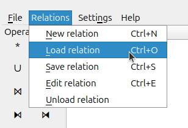
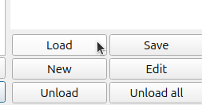

# Casos de Prueba - Práctico 2 (Álgebra Relacional)

Este repositorio contiene archivos con datos preparados para probar las consultas del Práctico 2 (2026) (en formato JSON y CSV).

Cualquier corrección o contribución que surja es más que bienvenida :)  

## Índice
1. [Descarga del repositorio](#descarga-del-repositorio)
2. [Carga de archivos y ejecución en Relational](#carga-de-archivos-y-ejecución-en-relational)
3. [Validación de resultados](#validación-de-resultados)

---

## Descarga del repositorio

### Opción 1: Descarga directa
Podés descargarlo como un archivo ZIP desde el botón verde "Code" que aparece arriba a la derecha (luego clickear "Download Zip").

### Opción 2: Clonar
Podés clonarlo directamente desde tu terminal:
```bash
git clone https://github.com/AgustinaHernandez/datos-relational-bd-2026
```

---

## Carga de archivos y ejecución en Relational

Dentro de la herramienta Relational:

1. Ingresá a **Relations > Load relation**



1. (o hacé click en el botón Load de la esquina inferior derecha)



2. Seleccioná los archivos (`.json` o `.csv`) que corresponden al ejercicio que querés probar.
3. Las tablas aparecerán cargadas en el panel izquierdo (Relations).
4. Escribí tu sentencia en álgebra relacional en el editor de texto y ejecutala.
5. Podés comparar la tabla que genere tu consulta con los [resultados esperados](./resultados_esperados.md).

> **Aclaración:** En los enunciados de la práctica, algunos atributos usan `#` (como `#art` o `#vuelo`). En estos archivos los vas a encontrar como `nro_art` y `nro_vuelo`. Tenelo en cuenta para tus consultas!

---

## Validación de resultados

Para verificar que tus resoluciones funcionan correctamente, revisá el archivo [resultados_esperados.md](./resultados_esperados.md). Allí se encuentran los resultados exactos que se esperan conseguir con las consultas en cada actividad.


## Detalles a tener en cuenta en Relational

- La operacion de igualdad se escribe como en Java como `==`, no `=`.
- La de desigualdad se escribe `!=`.
- Las fechas se escriben en el formato YYYYMMDD (año,mes,día), sin guiones. Por ejemplo, el 15 de julio de 2026 figura como `20260715`. Cuando escribas tus consultas asegurate de respetar este formato.


<br>
<br>

## Contacto

Para lo que necesiten (o si se les ocurre alguna mejora para este repositorio) pueden escribirme por Slack o por mail (ahernandez@dc.exa.unrc.edu.ar).

Muchos éxitos con el práctico :)

